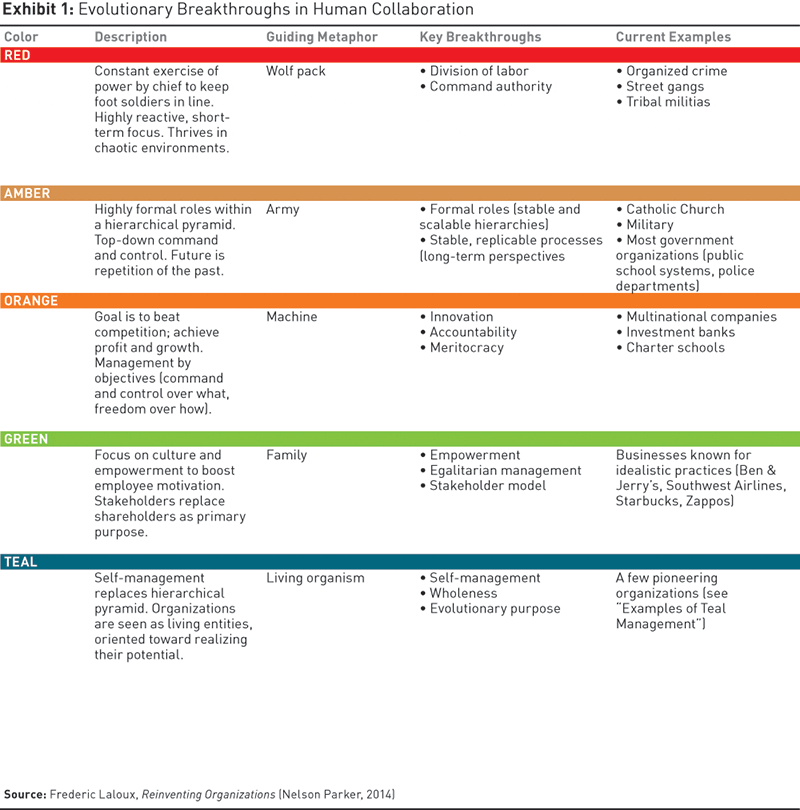

# DAO

A Decentralized Autonomous Organization (DAO) is a group of individuals who work together to govern an ecosystem and drive it to make decisions that benefit all members of the DAO.&#x20;

In a DAO there is no Top-Down traditional organizational structure. The decentralized autonomy is made possible through protocol or smart contracts which perform functions the DAO participants decide on.

If the concept of a DAO is new to you, it may sound strange. Most organizations we interact with, certainly that we trust our money with, have a traditional hierarchy that we're used to. Consider the work of Frederic Laloux, who defined organizations based on their guiding metaphors and key breakthroughs. In Laloux's model, a Teal organization is the evolution of human collaboration. It's what's beyond companies like Ben & Jerry's and Zappos. Think of DAOs in this way, as a type of organization built around self-management instead of hierarchy. A DAO operating in the context of smart contracts and automation which remove the need for trusted third parties is well positioned for key breakthroughs.

